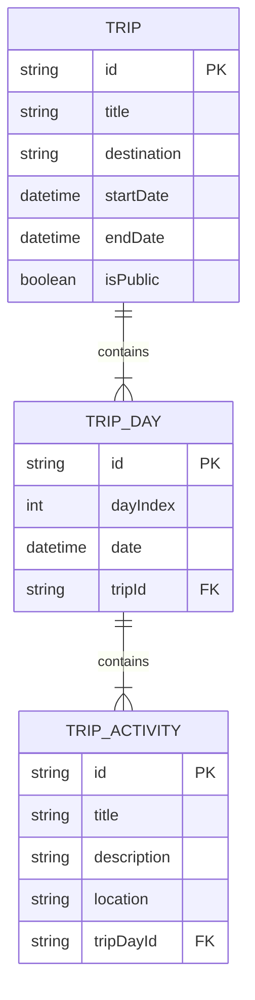
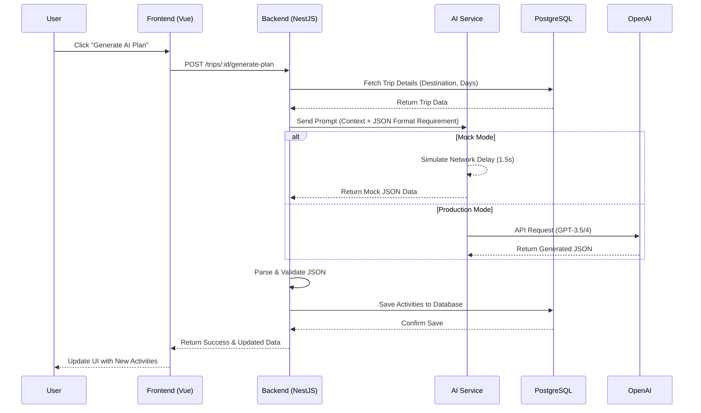

# 🌍 WanderPlan AI - Intelligent Travel Planner

> A full-stack intelligent travel planning application built with NestJS, Vue 3, and Generative AI.

[](https://vuejs.org/)
[](https://nestjs.com/)
[](https://www.typescriptlang.org/)
[](https://www.postgresql.org/)
[](https://www.docker.com/)

## 📖 Introduction

**WanderPlan AI** is designed to streamline the complex process of travel planning. Users simply input a destination and dates, and the system leverages AI to automatically generate detailed daily itineraries. 

The project adopts a **Human-in-the-loop** design philosophy, allowing users to manually adjust plans (add/remove activities) on top of AI-generated content, creating a truly unique travel experience.

This project demonstrates an **industry-standard full-stack architecture**, implementing a complete flow from database design and backend API development to frontend interaction.

### ✨ Core Features

* **🚀 Rapid Creation**: Set destination and dates; automatically calculates trip duration and initializes the schedule.
* **🤖 AI Generation**: One-click daily itinerary generation using LLMs (Integrated Mock mode & OpenAI API support).
* **📝 Flexible Editing**: Users can manually add custom activities to complement AI suggestions.
* **🗑️ Itinerary Management**: Full control to view details or delete unwanted itineraries.
* **🐳 Containerized Deployment**: One-click database provisioning using Docker Compose.

---

## 🛠️ Tech Stack

### Client (Frontend)
* **Framework**: Vue 3 (Composition API)
* **Build Tool**: Vite
* **Language**: TypeScript
* **Styling**: Tailwind CSS
* **Routing**: Vue Router
* **HTTP Client**: Axios

### Server (Backend)
* **Framework**: NestJS (Node.js framework)
* **ORM**: Prisma
* **Database**: PostgreSQL
* **Architecture**: Modular Design (Modules, Controllers, Services)

### Infrastructure & AI
* **Containerization**: Docker & Docker Compose
* **AI Integration**: OpenAI SDK (Swappable Mock Mode / Real API)

---

## 📸 Project Demo

Here's a quick look at WanderPlan AI in action:

### Home Page & Trip List


### AI-Generated Trip Detail


---

## 🚀 Getting Started

### Prerequisites
* Node.js (v18+)
* Docker & Docker Compose
* npm or pnpm

### 1. Clone the Repository
```bash
git clone [https://github.com/your-username/wander-plan-ai.git](https://github.com/your-username/wander-plan-ai.git)
cd wander-plan-ai

```

### 2. Start the Database (Docker)

Run the following in the project root:

```bash
docker-compose up -d

```

*This will spin up a PostgreSQL container on port 5432 (or 5433).*

### 3. Backend Setup (Server)

Open a new terminal window:

```bash
cd server

# Install dependencies
npm install

# Configure Environment Variables (See .env.example)
# Ensure DATABASE_URL matches your Docker port
cp .env.example .env 

# Run Database Migrations (Create tables)
npx prisma migrate dev --name init

# Start the Server
npm run start:dev

```

The backend server will run at `http://localhost:3001`.

### 4. Frontend Setup (Client)

Open another terminal window:

```bash
cd client

# Install dependencies
npm install

# Start the Client
npm run dev

```

Access the application at `http://localhost:5173`.

---

## 📂 Project Structure

```text
wander-plan-ai/
├── client/                 # Frontend Vue3 Project
│   ├── src/
│   │   ├── views/          # Page Components (Home, TripDetail)
│   │   ├── router/         # Router Configuration
│   │   └── App.vue
├── server/                 # Backend NestJS Project
│   ├── src/
│   │   ├── ai/             # AI Generation Module
│   │   ├── trips/          # Trip CRUD Module
│   │   └── prisma.service.ts
│   ├── prisma/             # Database Schema Definition
├── docker-compose.yml      # Docker Orchestration File
└── README.md

```


## 🏗️ System Architecture & Design

### 1. High-Level Architecture
The application follows a classic **Client-Server-Database** 3-tier architecture, enhanced with an external AI service integration.

```mermaid
graph TD
    User[User] -->|HTTP/HTTPS| Client["Client (Vue 3 + Vite)"]
    Client -->|REST API| Server[Server (NestJS)]
    
    subgraph Backend Services
        Server -->|ORM / SQL| DB[(PostgreSQL)]
        Server -->|Prompt Engineering| AI_Service[AI Service Module]
    end
    
    subgraph External
        AI_Service -.->|API Call| OpenAI[OpenAI / LLM Provider]
    end

```

### 2. Database Schema (ER Diagram)

The database is designed to handle trip data hierarchically. A `Trip` contains multiple `TripDay` records, and each day contains multiple `TripActivity` records.



### 3. AI Generation Sequence Flow

The core feature "AI Itinerary Generation" involves a complex data flow ensuring data persistence and UI reactivity.



## 🧩 Use Cases

| Actor | Action | System Behavior |
| --- | --- | --- |
| **User** | **Create Trip** | System calculates the duration based on start/end dates and initializes empty `TripDay` records in the database. |
| **User** | **Generate Plan (AI)** | Backend constructs a structured prompt, calls the LLM, and parses the JSON response into persistent `TripActivity` records. |
| **User** | **Manual Edit** | Users can manually add specific activities (e.g., "Visit Friend") to any specific day alongside AI-generated ones. |
| **User** | **Delete Trip** | Cascading delete ensures that when a trip is removed, all associated days and activities are cleaned up automatically. |


## 🗺️ Roadmap

* [ ] 🗺️ **Map Integration**: Visualize routes using Mapbox or Google Maps.
* [ ] 🔐 **User Auth**: Implement JWT Authentication for multi-user data isolation.
* [ ] 🧠 **Real AI Integration**: Switch from Mock Mode to GPT-4 for advanced personalization.
* [ ] 📱 **Mobile Adaptation**: Optimize responsive design for mobile devices.